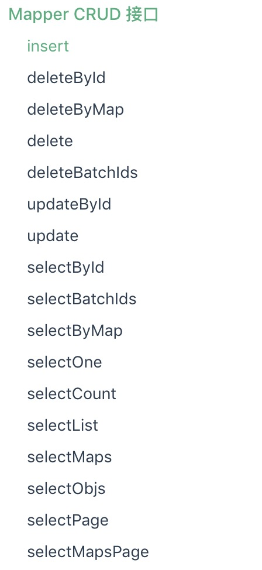

mybatisPlus入门
==


## 1 环境搭建

- 创建一个父工程`mybatisPlus_Learn`
    - pom文件导入依赖，相关依赖的说明pom文件中有说明
    
- 创建一个子工程`mybatisPlus-start`
    - 为了方便，这里就不导入任何依赖，所有的依赖都在父工程中导入了
 
- 增加application.yml文件，配置数据库相关信息
```yaml
server:
  port: 8080
spring:
  datasource:
    driver-class-name: com.mysql.jdbc.Driver
    username: root
    password: rootroot
    url: jdbc:mysql://localhost:3306/security
```
- application.yml中增加日志打印级别的配置

```yaml
#配置日志级别
logging:
  level:
    root: warn
    study.wyy.mybatisplus.dao: trace
```
由于mybatisplus一些日志的打印级别为trace，所以这里配置了dao包下的打印级别为trace

- 运行db文件下的sql脚本：`数据库脚本.sql`


## 2 BaseMapper

- 创建一个实体对象对应数据库中的user表

```java
package study.wyy.mybatisplus.pojo;

import com.baomidou.mybatisplus.annotation.TableField;
import com.baomidou.mybatisplus.annotation.TableId;
import com.baomidou.mybatisplus.annotation.TableName;
import lombok.Data;
import java.time.LocalDateTime;

@Data
public class User {
    /**
     * 主键
     */
    @TableId
    private Long id;
    
    private String name;

    private Integer age;

    private String email;
    /**
     * 直属上架，自关联
     *
     * mybatis默认就是驼峰命名，数据库字段的名字为manager_id
     *
     */
    private Long managerId;
    private LocalDateTime createTime;
    
}

```

- dao包创建一个`study.wyy.mybatisplus.dao.UserMapper`
    - 继承mybatisPlus提供的`com.baomidou.mybatisplus.core.mapper.BaseMapper`
    - 泛型指定为数据库表对应的实体类
  
- SpringBoot启动类
    - 指定mapper的扫描路径
```java
@MapperScan("study.wyy.mybatisplus.dao")
@SpringBootApplication
public class MybatisPlusStudyApplication {

    public static void main(String[] args) {
        SpringApplication.run(MybatisPlusStudyApplication.class, args);
    }

}
```
    
- 测试类
`study.wyy.mybatisplus.test.BaseMapperTest`

```java
@SpringBootTest
@RunWith(SpringRunner.class)
public class DemoTest {

    @Autowired
    UserMapper userMapper;

    @Test
    public void test(){

        User user = userMapper.selectById(1088248166370832385L);
        System.out.println("执行结果："+user);

    }
}
```

> BaseMapper提供了如下几个数据库操作的方法




**BaseMapper提供的方法`study.wyy.mybatisplus.test.BaseMapperTest`进行了相关测试，其中
分页相关的几个方法未进行测试**


## 3 条件构造器

QueryWrapper(LambdaQueryWrapper) 和 UpdateWrapper(LambdaUpdateWrapper) 的父类
用于生成 sql 的 where 条件, entity 属性也用于生成 sql 的 where 条件
**注意: entity 生成的 where 条件与 使用各个 api 生成的 where 条件没有任何关联行为**


> 测试代码
`study.wyy.mybatisplus.test.QueryWrapperTest`


## 4 定义sql

     
- 准备工作：
   1. application.yml中配置mapper映射文件的位置
    mybatis-plus:
       mapper-locations: mapper/*Mapper.xml
   2. 在UserMapper声明对应的方法

     

    @Test
    public void test16(){
        List<User> users = userMapper.selectMe();
        users.stream().forEach(user-> System.out.println(user));

    }
    
## 5 分页查询

- 配置分页插件

```java
package study.wyy.mybatisplus.config;

import com.baomidou.mybatisplus.extension.plugins.PaginationInterceptor;
import org.springframework.context.annotation.Bean;
import org.springframework.context.annotation.Configuration;

/**
 * @author wyaoyao
 * @data 2019-11-13 14:44
 */
@Configuration
public class MybatisConfig {

    @Bean
    public PaginationInterceptor paginationInterceptor() {
        PaginationInterceptor paginationInterceptor = new PaginationInterceptor();
        // 设置请求的页面大于最大页后操作， true调回到首页，false 继续请求  默认false
        // paginationInterceptor.setOverflow(false);
        // 设置最大单页限制数量，默认 500 条，-1 不受限制
        // paginationInterceptor.setLimit(500);
        return paginationInterceptor;
    }
}

```

> MybatisPlus在BaseMapper中提供了两个分页方法

- `IPage<T> selectPage(IPage<T> page, @Param(Constants.WRAPPER) Wrapper<T> queryWrapper);`
    - 根据 entity 条件，查询全部记录（并翻页）
- `IPage<Map<String, Object>> selectMapsPage(IPage<T> page, @Param(Constants.WRAPPER) Wrapper<T> queryWrapper);`
    -  根据 Wrapper 条件，查询全部记录（并翻页）
    
#### IPage接口
通过了一些方法可以获取一些分页信息

> 测试：`study.wyy.mybatisplus.test.PageTest`
```java
package study.wyy.mybatisplus.test;

import com.baomidou.mybatisplus.core.conditions.query.QueryWrapper;
import com.baomidou.mybatisplus.core.metadata.IPage;
import com.baomidou.mybatisplus.extension.plugins.pagination.Page;
import lombok.extern.slf4j.Slf4j;
import org.junit.Test;
import org.junit.runner.RunWith;
import org.springframework.beans.factory.annotation.Autowired;
import org.springframework.boot.test.context.SpringBootTest;
import org.springframework.test.context.junit4.SpringRunner;
import study.wyy.mybatisplus.dao.UserMapper;
import study.wyy.mybatisplus.pojo.User;

import java.util.Map;

/**
 * @author wyaoyao
 * @data 2019-11-13 15:03
 * 分页查询测试
 */
@SpringBootTest
@RunWith(SpringRunner.class)
@Slf4j
public class PageTest {


    @Autowired
    UserMapper userMapper;

    @Test
    public void selectPage(){
        // 设置分页信息,当前页为第一页，每页显示两条
        Page<User> page = new Page<User>(1,2);
        // 设置查询条件，查询年纪大于10的
        QueryWrapper<User> queryWrapper = new QueryWrapper<>();
        queryWrapper.ge("age",10);
        IPage<User> userIPage = userMapper.selectPage(page, queryWrapper);
        // 获取分页信息
        System.out.println("当前页："+userIPage.getCurrent());
        System.out.println("总页数："+userIPage.getPages());
        System.out.println("总条数："+userIPage.getTotal());
        System.out.println("记录数："+userIPage.getRecords());
    }

    /**
     * 和上一个分页的区别就是数据库信息封装成了一个map，这个区别
     * 和在seletc查询的时候已经说过，返回的泛型是实体和map的区别了
     */
    @Test
    public void selectMapsPage(){
        // 设置分页信息,当前页为第一页，每页显示两条
        Page<User> page = new Page<User>(1,2);
        // 设置查询条件，查询年纪大于10的
        QueryWrapper<User> queryWrapper = new QueryWrapper<>();
        queryWrapper.ge("age",10);
        IPage<Map<String, Object>> userIPage = userMapper.selectMapsPage(page, queryWrapper);
        // 获取分页信息
        System.out.println("当前页："+userIPage.getCurrent());
        System.out.println("总页数："+userIPage.getPages());
        System.out.println("总条数："+userIPage.getTotal());
        System.out.println("记录数："+userIPage.getRecords());
    }

    /***************************************************************************8
     *      刚刚的查询是进行了两次查询，先查询总记录数，在进行分页查询
     *      如果不想查询总记录数，也是可以的，
     *      使用Page类的三个参数的构造器，构造分页信息，第三个参数就是是否查询总记录数，
     *      true：查询
     *      false：不查询
     */

    @Test
    public void selectMapsPage2(){
        // 设置分页信息,当前页为第一页，每页显示两条
        Page<User> page = new Page<User>(1,2,false);
        // 设置查询条件，查询年纪大于10的
        QueryWrapper<User> queryWrapper = new QueryWrapper<>();
        queryWrapper.ge("age",10);
        IPage<Map<String, Object>> userIPage = userMapper.selectMapsPage(page, queryWrapper);
        // 获取分页信息
        System.out.println("当前页："+userIPage.getCurrent());
        System.out.println("总页数："+userIPage.getPages());
        // 这里返回的总条数就是0了
        System.out.println("总条数："+userIPage.getTotal());
        System.out.println("记录数："+userIPage.getRecords());
    }
}
```
## 6 通用service

web开发一般会注入分为三层：controller，service，dao

- 自定义service接口,继承IService接口（mybatisPlus提供），泛型为对应的实体
`study.wyy.mybatisplus.service.UserService`

- 实现自定义的service接口，继承ServiceImpl（mybatisPlus提供），实现我们自己的接口

- 内部就可以执行我们的业务逻辑，由于继承了继承ServiceImpl，泛型为对应的Mapper接口和实体，而这个类里面也提供了一堆数据库操作的方法
，翻看源码可以发其内部注入了我们的Dao层,可通过getBaseMapper方法拿到Mapper

```java
@SuppressWarnings("unchecked")
public class ServiceImpl<M extends BaseMapper<T>, T> implements IService<T> {

    protected Log log = LogFactory.getLog(getClass());

    @Autowired
    protected M baseMapper;

    @Override
    public M getBaseMapper() {
        return baseMapper;
    }

```
> 演示
```java
package study.wyy.mybatisplus.service.impl;

import com.baomidou.mybatisplus.core.conditions.query.LambdaQueryWrapper;
import com.baomidou.mybatisplus.core.metadata.IPage;
import com.baomidou.mybatisplus.extension.plugins.pagination.Page;
import com.baomidou.mybatisplus.extension.service.impl.ServiceImpl;
import org.springframework.stereotype.Service;
import study.wyy.mybatisplus.dao.UserMapper;
import study.wyy.mybatisplus.pojo.User;
import study.wyy.mybatisplus.service.UserService;


/**
 * @author wyaoyao
 * @data 2019-11-13 16:05
 */
@Service
public class UserServiceImpl extends ServiceImpl<UserMapper, User> implements UserService {

    /**
     * 分页查询用户
     * @return
     */
    @Override
    public IPage<User> pageUser(String name){
        // 这里书写我们的业务逻辑
        Page page = new Page(1, 2);
        LambdaQueryWrapper<User> wrapper = new LambdaQueryWrapper();
        wrapper.like(User::getName,"雨");
        IPage result = super.page(page, wrapper);
        return result;
    }
}
```